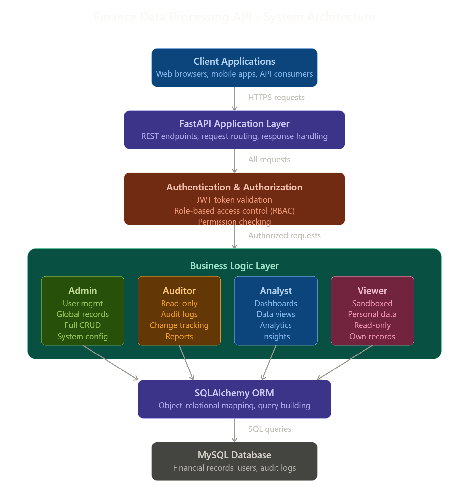

# Finance Data Processing and Access control Backend


# Project Description
Financial organizations face a critical challenge: how to provide secure, role-appropriate access to sensitive financial data while maintaining strict audit compliance and data isolation. Traditional monolithic systems often struggle with:

1.Over-permissioned access - Users getting more access than they need, creating security vulnerabilities
2.Lack of audit trails - Difficulty tracking who accessed what data and when, causing compliance headaches
3.Poor data isolation - Risk of users accidentally (or maliciously) viewing unauthorized financial records
4.Inflexible access control - Hard-coded permissions that can't adapt to different organizational roles.

# Why I Selected this project?
   Personal Motivation
   During my studies, I witnessed firsthand how poor access control in financial systems creates real problems with

   Security incidents where employees accidentally accessed customer financial data.
   Compliance nightmares during audits when teams couldn't prove who accessed what data and what changes they done.
   Frustrated users waiting days for support to retrieve their own transaction history.

   So those things helps me to do best to build this project.

## Features
- **FastAPI**: Fast and modern Python web framework.
- **SQLAlchemy ORM**: Connects the backend to a MySQL database.
- **JWT Authentication**: Secure login and session management.
- **Role-Based Access Control**:
  - `Admin`: Full access to manage users and global records and manage dashboards.
  - `Auditor`: Read-only access to global records with automatic auditing logs and changes records,manage data upload and download.
  - `Analyst`: View access to dashboards and global records,manage data insights
  - `Viewer`: Viewer can view only their personal records and can not make any changes.

## Requirements
- Python 3.10+
- MySQL Server or Docker Desktop

## How to Run

1. **Clone the repository** and navigate to the folder.
2. **Set up environment variables:**
   - Copy the `.env.example` file to `.env`:
     ```bash
     cp .env.example .env
     ```
   - Update the `DATABASE_URL` line inside the `.env` file with your MySQL credentials. (If you use the included docker-compose file, the defaults are already correct).

3. **Start the database (Optional):**
   If you have Docker Desktop installed, you can spin up the MySQL database easily:
   ```bash
   docker-compose up -d
   ```

4. **Install dependencies:**
   ```bash
   python -m pip install -r requirements.txt
   ```

5. **Start the API Server:**
   ```bash
   python -m uvicorn app.main:app --reload
   ```

6. Open your web browser and navigate to **http://127.0.0.1:8000/docs** to interact with the API via the automatic Swagger documentation.

# Architechture
